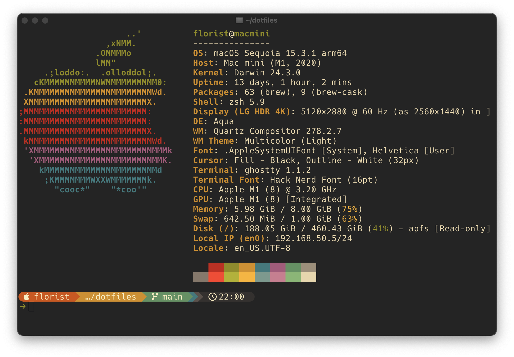
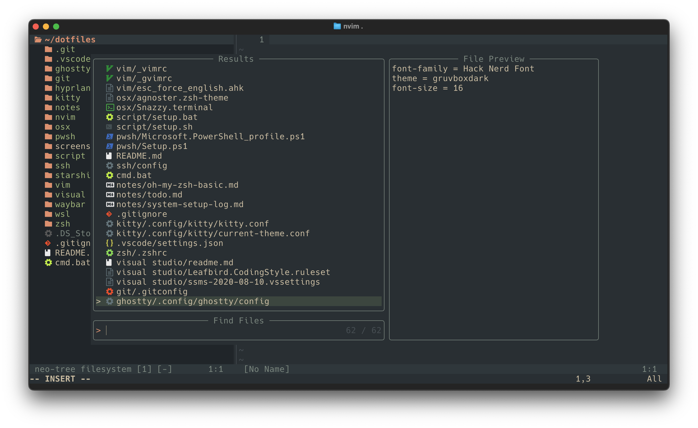
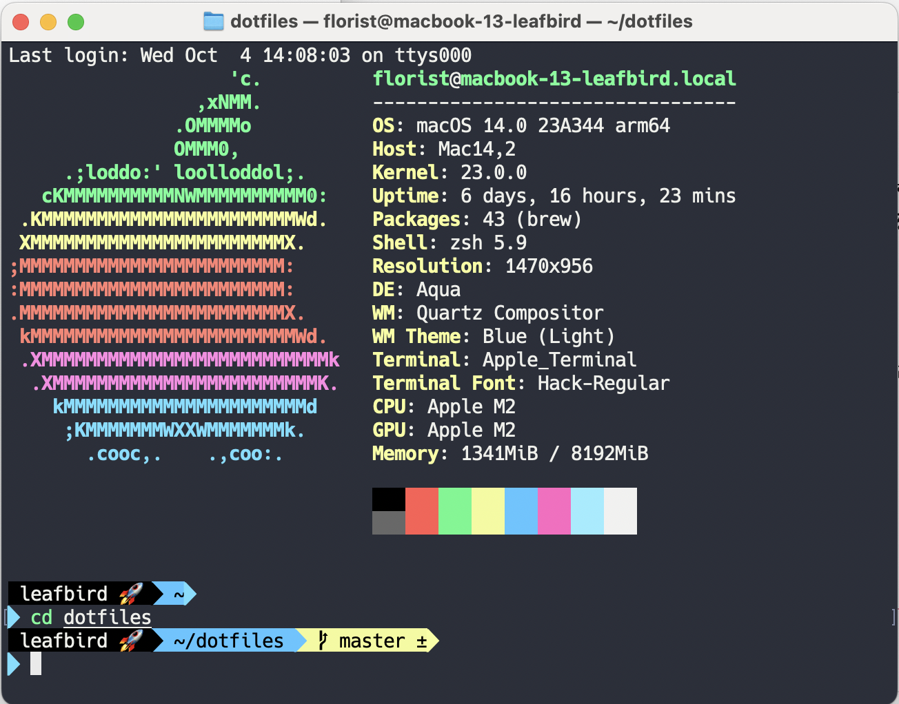
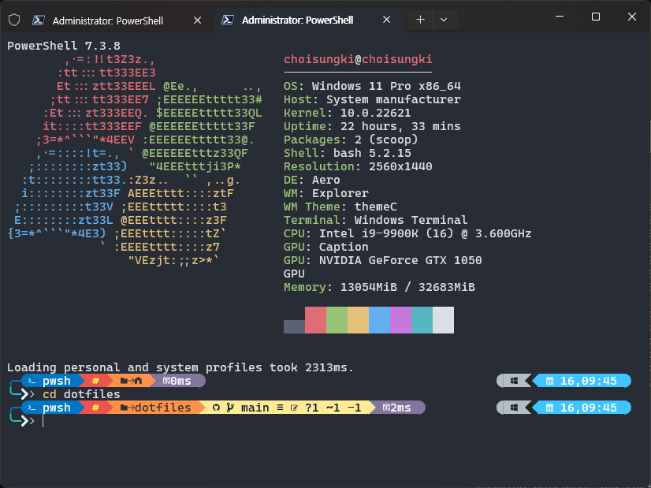

## dotfiles

### 2025-03-11 update

시간이 제법 흘렀고, 요즘의 dotfiles는 제법 변한 것들이 많아 readme를 한 번 갱신합니다.

* 기존에는 `windows`와 `mac`만 설정대상이었는데, 이제는 `linux`도 호환하도록 설정합니다. 
* windows에서는 여전히 `Windows Terminal`을 사용하고, `mac&linux`는 `ghostty`와 `warp`를 사용합니다. 
* `neovim`을 열심히 설정하고 있습니다. `neovim`에 익숙해 지는 일은 정말 즐겁습니다!
* `windows`는 한 방 설정 스크립트를 유지하지만, `mac&linux`는 `stow`를 사용해서 개별 설정을 적용합니다.
* 설정의 종류도 늘었습니다. `ghostty, git, hyprland, kitty, nvim, pwsh, starship, wsl...` 더 늘어날걸요.

## out-of-date: 예전 스크린샷

23년 10월 8일. mac의 순정 터미널입니다. oh-my-zsh를 사용해 프롬프트를 꾸몄습니다. 

23년 10월 16일. windows terminal입니다. oh-my-posh를 사용해 프롬프트를 꾸몄습니다. 
