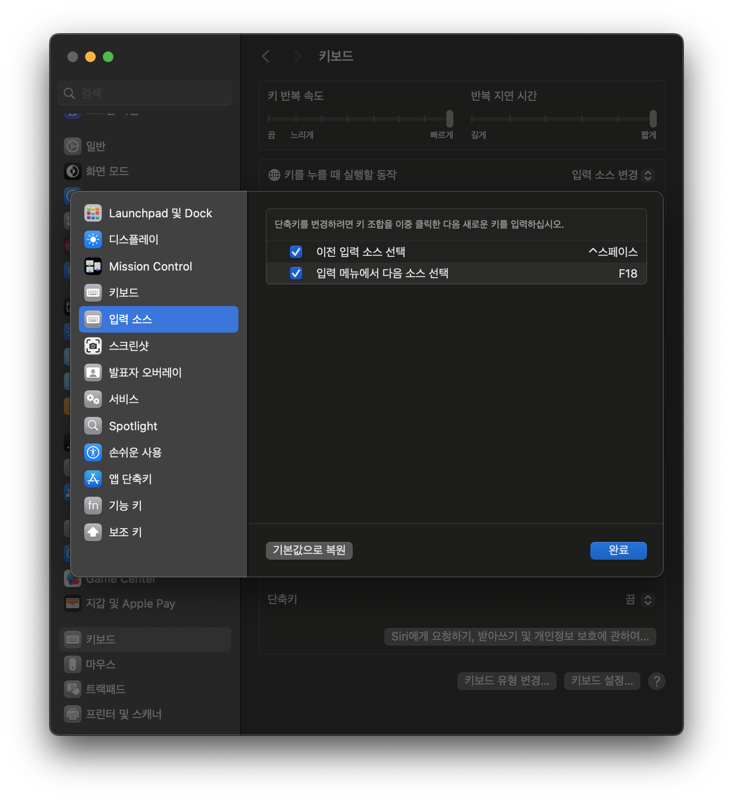
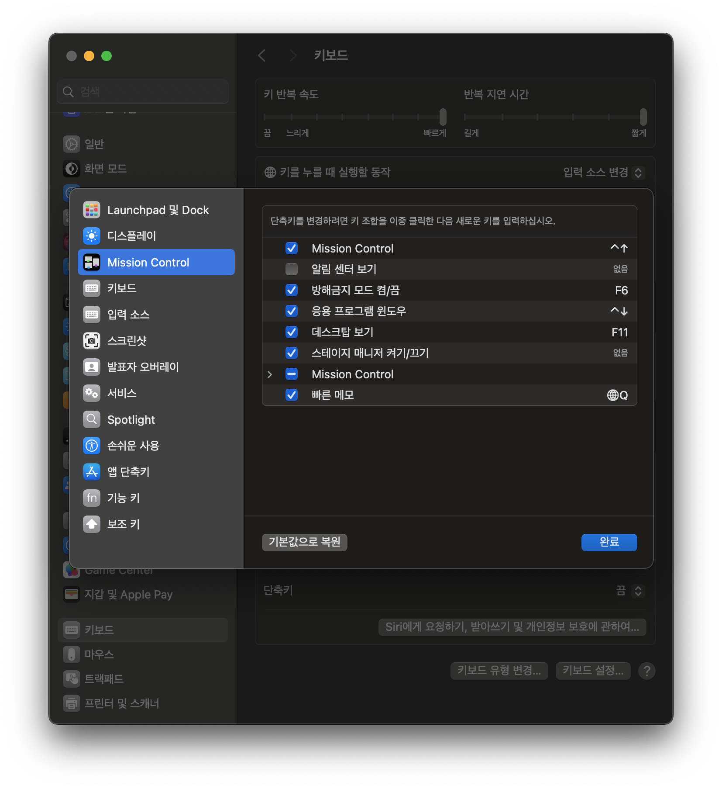
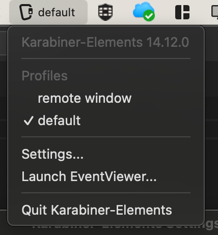

## macmini 키보드 설정

카라비너 및 키보드 관련 설정. setting file backup보단 직접 글로 정리해 두는 것이 나을 것 같아 문서로 정리.

## 스페이스 오른쪽 키를 한영키로

설정 > 키보드 > 단축키 > 입력소스 에서 `...다음 소스 선택`을 `f18`로 변경

카라비너에서 키보드 종류에 따라 `right_option` 혹은 `right_command`를 `f18`로 매핑.

## vim : insert -> normal mode 갈 때 영어 입력으로

참고 : https://torbjorn.tistory.com/812

* https://ke-complex-modifications.pqrs.org 에서 esc로 검색하고 `For Vim User Esc to en_US/ABC IME`를 찾아 설치
* (아마도) `ESC to ABC`를 활성화 해준다.

## 윈도우 배열로 된 키보드의 좌측 배열 수정

해당 키보드의 `Simple Modification`에 다음 매핑 지정

* `left_command`-> `left_option`
* `left_option` -> `left_command`

## function 의 미디어 기능과 표준 기능 전환

카라비너 `Function Keys` > `Use all F1, F2, etc. keys as standard function keys`가 프로필에 따라 설정을 달리할 수 있으면 좋겠지만 전역으로 밖에 설정되지 않음. 이 설정은 off해두어서 기본적으로 media 키로 동작하게 해둔다. 

새로운 프로필을 만들고 `Simple modifications`에서 `f2 -> f2` 처럼 자기 자신으로 가는 맵핑을 만들어주고 전환해 사용한다. 원격으로 윈도우에 접속했을 때나 코딩을 주로 할 때는 이게 더 편하다.

## f6으로 방해금지모드 동작 안하는 현상

참고 : https://github.com/pqrs-org/Karabiner-Elements/issues/2516#issuecomment-738617917

위 링크는 정말 참고만 할 것. osx 버전이 바뀌면서 상황이 자주 바뀌는 듯. 방해금지모드는 거의 쓰질 않아서 굳이 안 고쳐놔도 상관 없지만 일단 되게 해둔다.

* 설정 > 키보드 > 단축키 > 'Mission Control' 에서 `방해금지 모드 켬/끔`을 `f6`으로 변경

* 카라비너 `FunctionKeys > For all devices`에서 `f6 -> f6` 매핑 지정.

## 현재 카라비너 활성 프로필 이름을 메뉴바에 표시

`Setting > UI > Show profile name in menu bar` 항목 on

## 맥북 : 좌하단 fn 키 비활성

코딩할 때 윈도우 배열이랑 헷갈린다. control키로 바꿔두고, 우측 옵션키를 fn으로 해둔다.

`Apple Internal Keyboard`에서 아래 매핑 추가

* `fn`-> `left_control`
* `right_option`-> `fn`

## 윈도우 배열 키보드에 fn 추가

바로 위 설정이랑 동일하게 쓰도록. 앱코 `K935P` 기준 우측 컨텍스트메뉴 키를 fn으로 쓰려면

* `application` -> `fn`